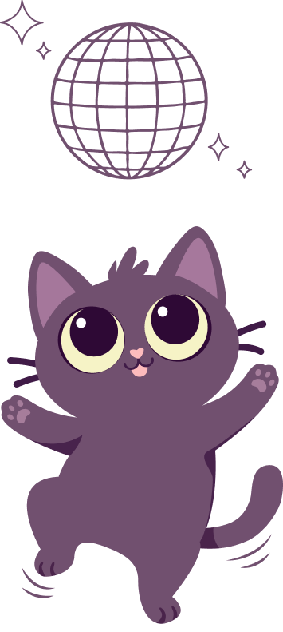

  
    
  

# Miaoutchi Dance Party 🎵
 
A rhythm game inspired by DDR and Guitar Hero, built entirely with Vanilla JavaScript and DOM manipulation — no frameworks, no libraries.
 
[▶ Play now](https://adrien-duchossoy.github.io/miaoutchi-game/)
 
---
 
## Gameplay
 
Press the arrow keys (← ↑ ↓ →) at the right moment as falling arrows reach the target zone. Survive all 5 levels and chase the highest score!
 
---
 
## Features
 
**Core mechanics**
- Falling arrows across 4 columns, each driven by an independent randomized spawn loop using `setTimeout`
- Collision detection running inside the `requestAnimationFrame` game loop, with 5 precision zones: `early`, `ok_early`, `perfect`, `ok_late`, `missed`
- Keyboard input handling with real-time collision matching
**Scoring**
- Zone-based scoring: Perfect → +100, OK → +50, Early → +10, Miss → -20
- Score display with live DOM updates
**Progression**
- 5 levels with increasing speed and arrow frequency
- Level-up screen with countdown between each level
- Game over triggered either by completing all levels or missing 5 arrows in a row
**Combo system**
- Streak tracking with configurable thresholds
- Animated popup images on streak milestones and on misses, with fade-in / fade-out animations
**Audio**
- In-game music and menu music with smooth crossfade transitions using volume interpolation
- Mute/unmute toggle
**UI & Visual**
- Animated gradient blob background
- Glassmorphism arrow design
- Animated static arrows on keypress (scale + glow)
- Countdown before each round
- Game Over modal displaying final score
- Restart without page reload
---
 
## Tech
 
- Vanilla JavaScript (ES6+)
- DOM manipulation
- `requestAnimationFrame` game loop
- CSS animations & keyframes
- No frameworks, no build tools